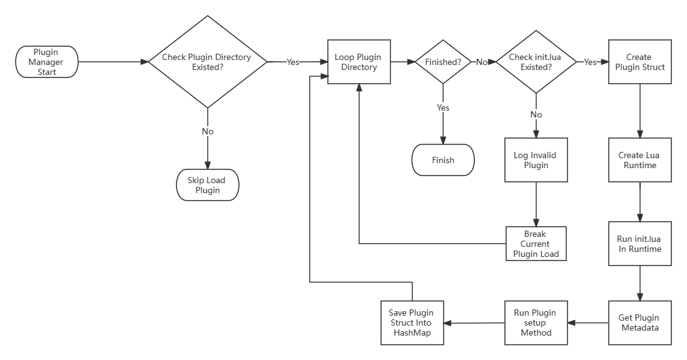

# Description
Plugin system is based lua script language.When system start, the plugin system scan the plugin directory and then load into seprate lua runtime instance.

# Design

## Metadata
Plugin export as a lua table.

Examples:

```lua

local M =  {}
M.author = "Samoye"
M.name = "TestPlugin"
M.description = "Just A Test Plugin"
M.version = "1.0.0"

M.hook.onConnectAuth = function(clientId, username, password, ip)
    return true
end

return M
```

### Plugin Basic Info
| name  | type  | description  | 
|---|---|---|
| author | string  | plugin author name  | 
| name   | string  | plugin name  |
| description   | string  | plugin description |
| version | string | plugin version |

### Plugin Setup Function
When plugin loaded succeed, the system would call the setup() function, the plugin could use setup function to init the plugin.

## Plugin Safety
The plugin can`t require any other c api modules.The plugin instance runtime is seperated.

## Plugin Folder Struct

```
plugin_a/
├─ doc/
├─ src/
│  ├─ common/
│  │  ├─ utils.lua
│  ├─ plugin.lua
├─ README.md

```

## Plugin Load Flow


## Plugin API Design (Draft)

### samoye.hook
#### Register System Hook Function
```
samoye.hook.register(hookName:String, functionName:String)
```

Register hook function with function name which returnd from init.lua.

System Hook Table

| Hook  | Parameters  | description  | 
|---|---|---|
| OnConnectAuth |(clientId:String, username:String, password:String, ip:String) | called when new client connect to broker | 
| OnPublishAclCheck | (ctx:Context, pubTopic:String, qos: Int) | called when client publish message |
| OnSubscribeAclCheck | (ctx:Context, subTopics: String[], qos: Int) | called when client subscribe topics |
| OnPublish | (ctx:Context, publishPacket:Packet) | called when broker received publish packet |

### samoye.api.net
#### Http
```lua
/* GET */
local client = samoye.api.net.http.client:new()
local res = client.get("https://www.test.com")

/* POST  Body*/
local res = client.post("http://test.com").body("test").send

/* POST Form */
local res = client.post("http://test.com").form({
    ["username"] = "hellen"
}).send

/* PUT Body*/
local res = client.put("http://test.com").body("test").send

/* POST Form */
local res = client.put("http://test.com").form({
    ["username"] = "hellen"
}).send

```

### samoye.api.db.mysql
#### Connection Pool
```lua
local pool = samoye.api.db.mysql.pool:new(url)
```
Create the mysql connection pool

#### Get Connection From Pool
```lua
local conn = pool:get_conn()
```
Get mysql connection from connection pool

#### SQL Query

simple query
```lua
cur, error = conn:execute([[SELECT username,age FROM test ]])
row = cur:fetch_next()
print(row.username)
```

named parameters query
```lua
cur, error = conn:execute_with_params([[SELECT username, age FROM test WHERE age > :age]],{age = 10})
row = cur:fetch_next()
print(row.username)
```

Using sql query database


## Plugin Example
