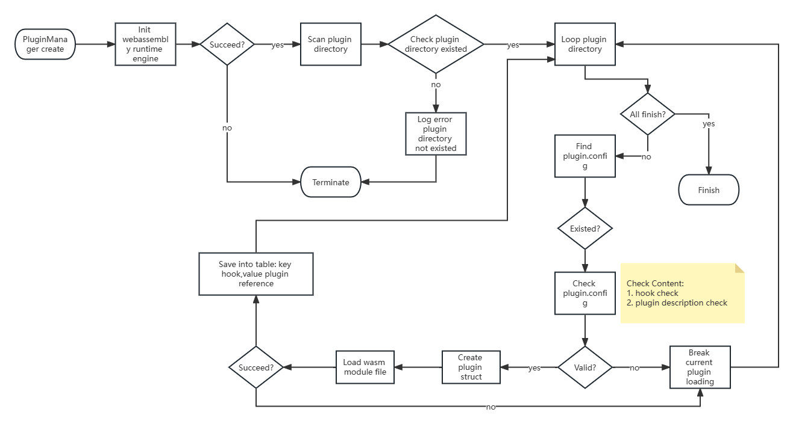

# Description
Plugin system is based webassembly runtime.Every webassembly module is a plugin.When system start, the plugin system scan the plugin directory and then load into seprate module.

# Design
## Plugin Metadata

1. The plugin metadata writen in tomal format.
2. The plugin metadata tomal name must be plugin.toml.

|item|type|description|
|----|----|-----------|
|name|string|the plugin name|
|description |string| the plugin description|
|author|string| the plugin author|
|hook|string| where the plugin called|
|entry_func|string| the entry function in webassembly module|

example:
```toml
[metadata]
name = "HelloWorldPlugin"
description = "This is a demo plugin."
author = "samoya"
hook = "OnConnectAuth"
entry_func = "CheckUserPermission"
```

## System Hook
|hook|description|
|-----|-----------|
|OnClientAuth| Called when client connect to the broker and send the ConnectPacket |

## Plugin Manager Init Flow

